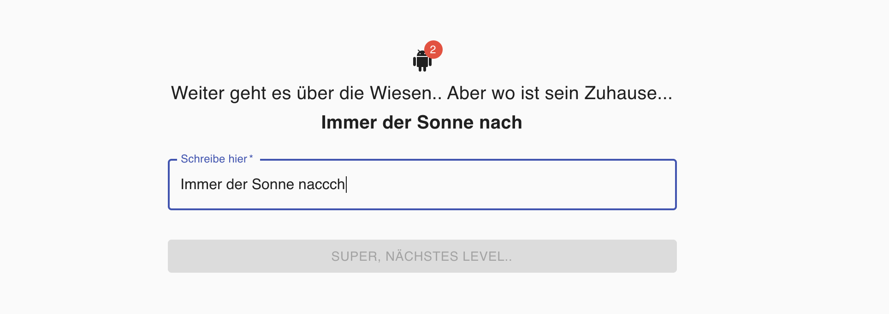

# Kleine Tipp-Übung für Grundschulkinder

## Warum?

Es gibt keine einfache Webseite, wo Grundschulkinder einfach mal ein paar Sätze tippen üben können. Sie müssen erstmal die richtigen Tasten finden, verstehen was "Shift" und "Space" ist, die Pfeiltasten bedienen etc. Die meisten Webseiten draussen sind entweder komplex, hässlich oder basieren auf Flash (oder alles zusammen).

## Wie?

Die React Seite wird komplett auf dem Browser ausgeführt und in einem JS file kann man die Geschichte konfigurieren, welche die Kinder nachtippen sollten.

## Demo

Eine [Demo](https://jzakotnik.github.io/input-tutorial/) hier.

